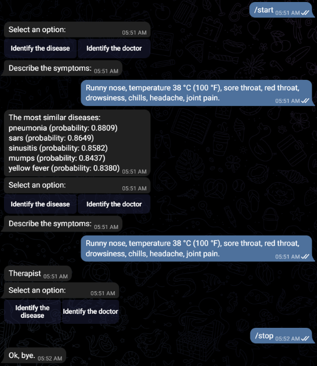
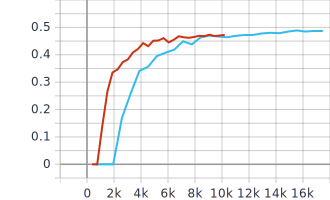
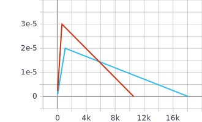

<a rel="license" href="http://creativecommons.org/licenses/by-nc-nd/4.0/"></a><br />This work is licensed under a <a rel="license" href="http://creativecommons.org/licenses/by-nc-nd/4.0/">Creative Commons Attribution-NonCommercial-NoDerivatives 4.0 International License</a>.

# DocHack

A Telegram bot for identifying diseases and doctors by a description of the symptoms.



## Evaluation results

BERT:
```javascript
LRAP = 0.5867235614792822
eval_loss = 0.1558876243572702
f1 = 0.43116946664491923
```

ROBERTA:
```javascript
LRAP = 0.610907659358978
eval_loss = 0.1509880079086035
f1 = 0.47227688389859934
```

<details>
  <summary>TensorBoard charts</summary>
  
  
  
  
  
  
</details>
